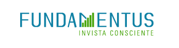
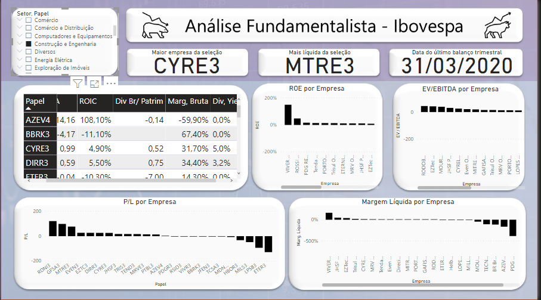

# Projeto_ETLFundamentus
Raspagem de dados do site <i>fundamentus.com.br</i>, trazendo dados fundamentalistas de ações brasileiras para visualização e comparação utilizando Power BI.

# Ser ou não um Stonker, eis a questão?

Sempre tive uma mentalidade de poupador, desde pequeno. Ao começar a trabalhar e ter mais contato com finanças comecei a pensar se não seria interessante investir na bolsa de valores. 

A principal ideia da minha carteira é ser exposta aos mais diversos setores da ecomonia, comprando as melhores empresas de cada. 
Como tinha dificuldade para comparar papeis de um mesmo setor, raspei os dados do site fundamentos e criei uma visualização no Power BI. Utilizo muito o dashboard para decidir sobre a insersão de um determinado papel na minha carteira.

O Projeto é aberto para que melhore a vida de qualquer pessoa que enfrentava o mesmo problema que eu.
Usem sem moderação.

